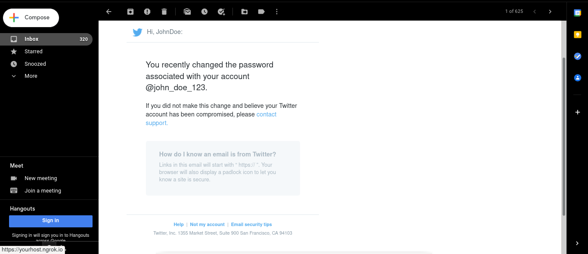
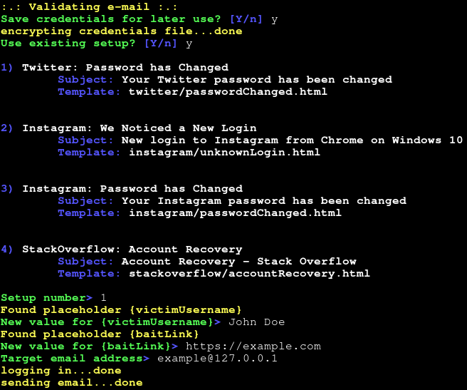

# Contents #

1. [About](#about)
2. [Disclaimer](#disclaimer)
3. [Requirements](#requirements)
4. [Features](#features)
5. [Demonstration](#demonstration)
6. [Installation](#installation)

# About #

**phishfactory** offers a variety of email templates for spear-phishing
attacks.

# Disclaimer #
This program was created for purely educational purposes.

**_Only you_** are responsible for the consequences of any
misuse of this program. 

It is **illegal** to attempt at phishing someone **without their consent**. 

## Requirements ##
- `pyAesCrypt==0.4.4`

## Features ##

- Email attachment(s)
- Save your encrypted credentials for future use (pyAesCrypt)
- A variety of **setups**; each setup is defined by a **subject** 
and a specific **HTML email template**

    ##### HTML Templates #####
    
    - Each HTML template has a set of **placeholders**, identified
    between curly brackets `{}`
    
    - When you send an email, **phishfactory** allows you to
    substitute these **placeholders** to customise your
    attack
    
    - This makes your attack **credible**. Hence **phishfactory**'s
    usefulness for spear-phishing
 

# Demonstration #
Not only does Google Mail not recognise this phishing email as spam
or vulnerable to phishing, while including the link
https://yourhost.ngrok.io (a platform which allows you to "publish" a server in your localhost, useful for phishing, and used in other phishing tools), but the email received is automatically marked as important.

However, emails containing any _bit.ly_ link were immediately marked as a potential phishing attack.

#### How phishfactory looks in the command line ####

# Installation #

### Note ###
Executing **phishfactory** and **install.py** as root is only required if **"install_dir"** located in **config.json** requires root access (by default **/usr/share** and if **"cmd_dir"** requires root access (by default **/usr/local/bin**).

**config.json** can be modified to change the _command_ and _installation_ directory.

- `git clone https://github.com/werdox/phishfactory`
- `cd phishfactory`
- `pip3 install -r requirements.txt`
- `sudo python3 install.py`
- `sudo phishfactory`
- __`enjoy`__
